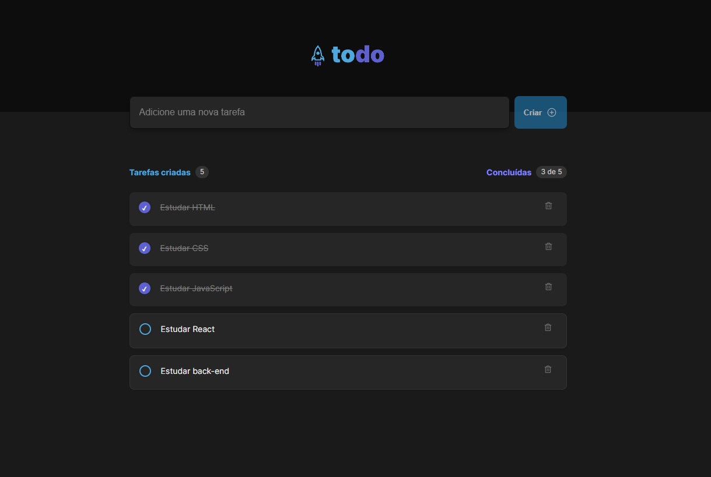

<h1 align="center">
 
</h1>
<p align="center">
  <a href="#-tecnologias">Tecnologias</a>&nbsp;&nbsp;&nbsp;|&nbsp;&nbsp;&nbsp;
  <a href="#-projeto">Projeto</a>&nbsp;&nbsp;&nbsp;|&nbsp;&nbsp;&nbsp;
  <a href="#-como-rodar">Como rodar</a>&nbsp;&nbsp;&nbsp;|&nbsp;&nbsp;&nbsp;
  <a href="https://to-do-list-delta-ashy.vercel.app" target="_blank">Acesse o site</a>
</p>

<br>




## 🚀 Tecnologias

Esse projeto foi desenvolvido com as seguintes tecnologias:

- [Vite](https://vitejs.dev/)
- [React JS](https://pt-br.reactjs.org/)
- [TypeScript](https://www.typescriptlang.org/)
- [Figma](https://www.figma.com)

## 💻 Projeto

O projeto representa um desafio no qual tive a oportunidade de aplicar de forma prática os conhecimentos adquiridos durante o módulo, assim como realizar a utilização do Figma e efetuar na minha perspectiva o design completamente idêntico á referência. Afinal, essa abordagem se revela como a mais eficaz para a validação do aprendizado.

O projeto consistiu na criação de uma lista de tarefas (To-Do List), permitindo aprofundar consideravelmente nos conceitos fundamentais do React. Tive a oportunidade de explorar temas essenciais, como componentes, propriedades, estados, e, sobretudo, compreender a importância de uma sólida arquitetura de componentes. Isso se mostrou crucial para garantir que a transmissão de propriedades ocorresse de forma eficiente e sem problemas.

## 🖼 Confira a Demo
<p> <a href="https://to-do-list-delta-ashy.vercel.app" target="_blank"> Confira o site </a> </p>

## 🔧 Como rodar

### 🗂 Faça um clone do projeto

```bash
git clone https://github.com/RenanLuca/To-Do-List.git
```

### 📥 Instale as dependências
```bash
# Acesse o diretório do projeto
cd to-do-list

# Instale as dependências
yarn 
```

### ⚡ Inicie a aplicação
```bash
yarn run dev
```

Me adicione no [LinkedIn](https://www.linkedin.com/in/renanLuca/) :wave: